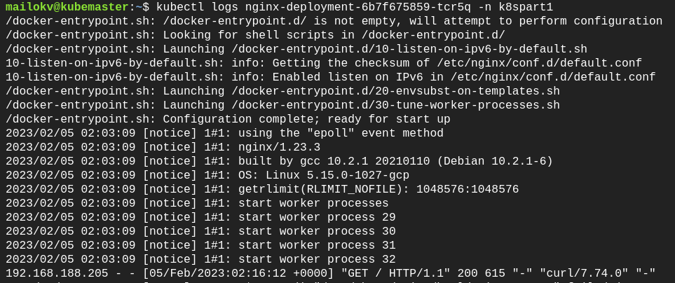
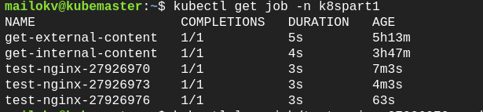

# Task k8s part 1

1. Get information about your worker node and save it in some file

2. Create a new namespace (all resources below will create in this namespace)

3. Prepare deployment.yaml file which will create a Deployment with 3 pods of Nginx or Apache and service for access to these pods via ClusterIP and NodePort. 

  a) Show the status of deployment, pods and services. Describe all resources which you will create and logs from pods

4. Prepare two job yaml files:
One gets content via curl from an internal port (ClusterIP)
Second, get content via curl from an external port (NodePort)

5. Prepare Cronjob.yaml file which will test the connection to Nginx or Apache service every 3 minutes.

===============================================================================
## 1.  Information about worker node

Using the command below I got the information about the worker node and redirected it to a file.

~~~
kubectl describe node kubenode > infoworkernode
~~~

## 2. Creating Namespace

To create a new namespace "k8spart1" I used the following command.

~~~
kubectl create namespace k8spart1
~~~

In the future, I created all the resources in this namespace.

## 3. Creating Deployment and Service

I used a yaml file to create the deployment and services.

In this file, I indicated that I need 3 replicas under which there will be nginix of the latest version.

This file also describes the instructions for creating a service for access to these pods via ClusterIP and NodePort.

I ran the deployment using the command below.

~~~
kubectl apply -f nginx-deployment.yaml
~~~

The following command allows you to view information about the deployment.

~~~
kubectl get deployment --namespace=k8spart1
~~~

The images below show the created pod and service deployment

Used the following command I got the deployment description which I created earlier.

~~~
kubectl describe deploy nginx-deployment -n k8spart1
~~~

With the help of similar commands, I got a description of the services.

~~~
kubectl describe services my-cluster-ip -n k8spart1
kubectl describe services my-node-port -n k8spart1
~~~

I used the next command to get the description of the pod.

~~~
kubectl describe pods nginx-deployment-6b7f675859-9ghfd -n k8spart1
~~~

With the help of this command, I got a log of the pod in a k8spart1 namespace:

~~~
kubectl logs nginx-deployment-6b7f675859-tcr5q -n k8spart1
~~~

## 4. Job

Two yaml manifests were prepared for the following task.
The first job fetches content from pods via curl from an internal port(ClusterIP).
The second job fetches content from pods via via curl from an external port(NodePort).

To execute the job from the file, the following commands were executed:

~~~
kubectl apply -f job-get-external-port.yaml
kubectl apply -f job-get-internal-port.yaml
~~~

To view the list of jobs, used the following command:

~~~
kubectl get jobs -n k8spart1
~~~

I used the next command to get the description of the jobs.
~~~
kubectl describe job get-internal-content -n k8spart1
kubectl describe job get-external-content -n k8spart1
~~~

For convenience, I added pods of jobs in the variable.

~~~
pods=$(kubectl get pods --selector=job-name=get-external-content --namespace=k8spart1 --output=jsonpath='{.items[*].metadata.name}')
echo $pods
~~~

Then, with the help of the following command, I got the logs for both jobs in my namespace k8spart1.
Logs for job get external content:

~~~
kubectl logs $pods -n k8spart1
~~~

~~~
pods2=$(kubectl get pods --selector=job-name=get-internal-content --namespace=k8spart1 --output=jsonpath='{.items[*].metadata.name}')
echo $pods2
~~~

Logs for job get internal content:

~~~
kubectl logs $pods2 -n k8spart1
~~~

## 5. CronJob

I configured a yaml file with a Cronjob that runs every 3 minutes and checks the status of nginx.
The following command is used to run the Cronjob:

~~~
kubectl create -f cronjob-test-nginx.yaml
~~~
I got the Cronjob information using the following command:
~~~
kubectl get cronjob test-nginx -n k8spart1
~~~

The following picture shows all running jobs (two created in the previous task and 3 created by Cronjob).

Using the commands below, I checked the jobs logs created by Cronjob.

~~~
kubectl logs job/test-nginx-27926976 -n k8spart1
kubectl logs job/test-nginx-27926973 -n k8spart1
kubectl logs job/test-nginx-27926970 -n k8spart1
~~~

I used the following command to get the Cronjob description:

~~~
kubectl describe cronjob test-nginx -n k8spart1
~~~

